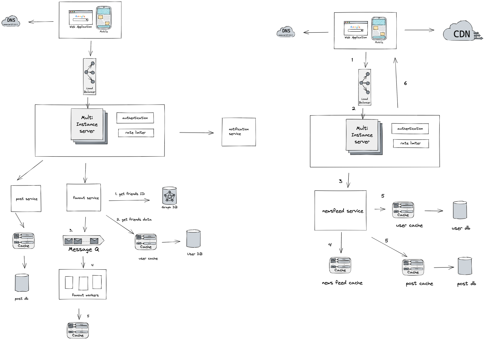

# Design Instagram

## Requirement

### Functional

- upload/download/view photos
- user can perform searches based on photo/video titles
- user can follow other users
- news feed consisting of top photos from all the people user follows

### Non-functional Requirements

1. service needs to be high available
2. acceptable latency of sytem is 200 ms for News feed generation
3. Consistency can take a hit (to trade of availablity) if user doesn't see a photo for a while; it should be fine
4. The system should be high relaible; any uloaded photos or video should never be lost

Not in the scope: adding tags, search photos on tags, commenting on photos, tagging users to photos.

## Some design considerations

The system would be read-heavy, and the goal is to build system that can retrieve photos quickly.

1. user should be able to upload as many photos as they like. Therefore, efficient managemetn of storage should be a crucial factor
2. low latency is expected when viewing photos
3. data should be 100% relaible. Photo shouldn't be lost

## Component Design

photo uploads (or writes) can be slow as they have to go to the disk, whereas reads will be faster, especially if they are being served from cache

Since each server has max connection, say 500 at any time, then it can't have more 500 concurrent uploads or reads at the same time. To handle this bottleneck, we can split reads and writes into separate services. Dedicated servers for reads and different servers for writes to ensure uploads don't take down the whole system.

## Reliability and Redundancy

losing files is not an option for our service. Therefore, we will store multiple copies of each file so that if one storage server dies, we can retrieve the phot from the other copy present on a different storage server

We need redundancy removes the single point of failure in the system

If only one instance of a service is required to run at any point, we can run a redundant secondary copy of the service that is not serving any traffic, but i can take control after the failover when the primary has a problem.

Creating redundancy in a system can remove single point of failure and provide a backup or spare funcitonality if neede in a crisis. For example, if there are two instances of the same service running in production and one fails, the ssytem can failover to the healthy copy. Failover can happend automatically or require manual intervention.

## Data Sharding

a. Partitioning based on USERID. Let's assume we shard based on the UserID so that we can keep all photos of a user on the same shard. If one DB shard is 1TB, we will need four shards to store 3.7TB of data. Let's assume, for better performance and scalability, we keep 10 shards.

So we will find the shard number by UserID % 10, and then store the data there. To uniquely identify any photo in oursyste, we can append ShardID with each photoID, it will make it unique throughout our system

Issues with this partioning scheme:

1. How would you handle hot users ?
2. Some users will have a lot of photos compared to others, thus making a non-uniform distribution of storage.
3. Waht if we cannot store all pictures of a user one one shard? If we distribute photos of a user onto multiple shards
4. Storing all photos of a user on one shard can cause issues like unavailability of all the user's data if that shard is down.

b. Partitioning based on PhotoID If we can generate unique PhotoIDs first and then find a shard number through “PhotoID % 10”, the above problems will have been solved. We would not need to append ShardID with PhotoID in this case, as PhotoID will itself be unique throughout the system.

How can we generate PhotoIDs? Here, we cannot have an auto-incrementing sequence in each shard to define PhotoID because we need to know PhotoID first to find the shard where it will be stored. One solution could be that we dedicate a separate database instance to generate auto-incrementing IDs. If our PhotoID can fit into 64 bits, we can define a table containing only a 64 bit ID field. So whenever we would like to add a photo in our system, we can insert a new row in this table and take that ID to be our PhotoID of the new photo.

Wouldn’t this key generating DB be a single point of failure? Yes, it would be. A workaround for that could be to define two such databases, one generating even-numbered IDs and the other odd-numbered.

We can put a load balancer in front of both of these databases to round-robin between them and to deal with downtime.

## Cache and Load balancing

Our service should push its content closer to the user using a large number of geographically distributed photo cache servers and use CDNs. The load balancer will distribute the user requests to various servers uniformly. We can use IP-based routing for the Newsfeed service, as the same user requests go to the same server, and caching can be used to get a faster response.

## API Gateway

We have a lot of services for our system. Some will generate newsfeed, some help storing photos, some viewing the photos, etc. We need to have a single entry point for all clients. This entry point is API Gateway.

It will handle all the requests by sending them to multiple services. And for some requests, it will just route to the specific server. The API gateway may also implement security, such as verifying the client’s permission to perform the request.

## NewsFeed Generation:

The News Feed for any user contains the latest, most popular, and relevant photos of the people that the User follows. If we generate the newsfeed in real-time, it would be very high latency. We will pre generate the newsfeed.

Now, how does a user get the latest newsfeed from the server? We may consider below approaches:

### Pull-Based Approach

In this approach, each User may poll the server after a regular interval to check if any friend has a new update. The server has to find all the user connections and check for each friend to create a new post. If there are new posts, the database’s query will get all the recent posts created by a user’s connections and show them on their home page.
The users may ping the Newsfeed servers for pre-generated feeds after a regular interval. The lower the time interval, the more recent data will be found in the feed.
This approach is time-consuming. As users are polling the database after a regular interval, it will put a huge amount of unnecessary load on the database.

### Push-Based Approach

In this approach, servers can push new data to the users as soon as it is available. Users have to maintain a long polling request with the server for receiving the updates.
As the Newsfeed service is pre generating the feeds, the Notification service will notify the active users about the new posts. Session DB will keep data of the user’s connections who are online.
You may check the various notification approaches at this link.
We may implement a pull-based model for all the users who have a high number of followers. And we can use a push-based approach for those who have a few hundred followers.

### Pagination:

The newsfeed of users can be a large response. So, we may design the API to return a single page of the feed. Let’s say we are sending at most 50 posts every time a feed request is made.
The user may send another request for the next page of feeds for the next time. And within that period, if there is not enough feed, Newsfeed may generate the next page. This technique is called pagination.

## NewsFeed APIs

### Feed publish API

- TO publish a post, a HTTP POST request will be sent to server,

### Newsfeed retrieval API

### Fanout service building news feed

fanout is the process of delivering a post to all friends. Two types:

- fanout on write (push mode)
- fanout on read (pull mode)

_Fanout on write_ (i.e Push) :
pros

- news feed is genreated in real-time and can be pushed to friends immediately
- fetching news feed is fast because news feed is pre-computed during write time

cons:

- If user has many friends, fetching friends list and generating news fees for all of them are slow and time consuming. It's called hotkey problem
- for inactive users, pre-computing news feed are waste of resources

_Fanout on read_ (i.e Poll)
news feed is generated during the read time. This is on-demand model. Recent posts are pulled when a user loads her home page
pros:

- for inactive users it works better because it will not waste resources
- Data is not pushed to friends so there is no hot key problem

cons:

- fetching the news feed is slow as news feed is not pre-computed
- might create huge amount of query if users are pull together

The solution we have, is hybrid model

- fetching the newsfeed fast is crucial, we used a push mode for majority of users.
- for celeberities, we let followers pull news content on-demand t avoid system overload
- consistent hashing is a useful technique to reduce the hotkey problem as it helps to distribute request/data more evently

The fanout service works as follows:

1. Fetch friends IDs from graph database
2. Get friends info from the user cache. The system filters out friends based on user settings. For example, if you mute someon, her post will not show up in your news feed. Another reason that a post might not be shown is that a user could selectively share information with set of friends
3. send friends list and new post ID to the message queue.
4. Fanout workers fetch data from the message queue and store news feed data in the news feed cache. WE only store <post_id, user_id>. Whenever a new post is made, it will append to a table. The memory consumption can be large if we stord entire user and post objects in the cache. Thus only ID are stored. Since most of users are interested in recent post, the cache miss is low
5. Store <post_id, user_id> in news feed cache.

### Newfeed retrieval

1. A user sends a request to retrieve her news feed
2. The load balancer distributed requests to web servers
3. web servers call the news feed service to fetch news feeds
4. news feed service gets a list of post ID from news feed cache
5. A users' news feed contains more a list of feeds ID, it contains username, profile picture, post content, post image etc. Thus, news feed fetch complete user and post objects from both user cache and post cache.
6. The fully hydrated news feed is retuend in JSON format back to the client for rendering.

### Cache architecture

Cache is extremely important for a news feed system

1. News feed: news feed (stores ID of news feeds)
2. Content: hot cache, normal (every post data, poppular contetn is stored in hot cache)
3. Social graph: follower, following (stores user relationship data)
4. Action: liked, replied, others (it stores info about whether a user liked a post, replied a post or other actions)
5. Counters: like counter, reply counter, other counters (all kinds of counters)

